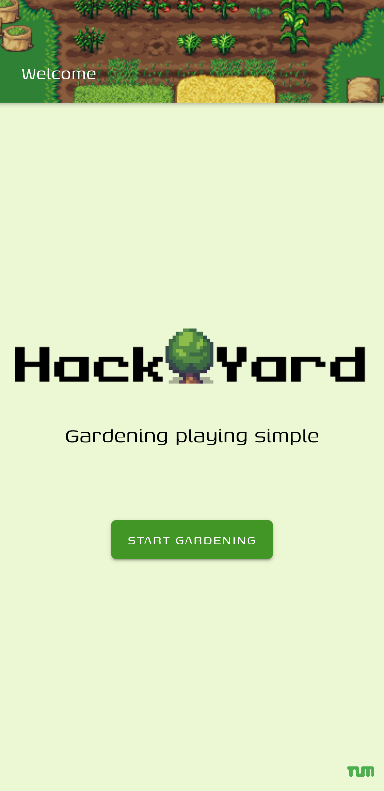

# HackYard
**Gardening playing simple**



Our application helps people, especially these who are new to gardening, to keep their garden and flowers intact. It sends reminders in an adjustable timeframe to water your indoor plants. Based on the weather of the last few days, it sends you hints if the plants need to be watered outside and how much they actually need to prevent gardeners to waste a huge amount of water. The app also reminds you to harvest and suggests the best time to prune your plants so they will be in full bloom again the next year. Because of build-in gamification elements it hopefully helps people to stay motivated to take care of their plants or even support experienced gardeners with a bee friendly plant counter to make their gardens more sustainable.

**Currently you have 0 bee friendly flowers.**

So all in all the apps helps the gardners to manage their plants meanwhile creating an oasis of wellbeing for plants and animals.

## Start Development
```
npm install
```

## Run backend server
```
cd server
nodemon server 
```

## Run frontend
```
ionic serve
```

## Seed database
```
mongoimport --db mongodb --collection plantRecords --file plantDB.json --jsonArray
```

# Content Sources

- Text sources
    - https://www.discoverwildlife.com/how-to/wildlife-gardening/how-to-make-a-bee-friendly-garden/
    - https://garden.org/

- Image artists
    - Daniel Eddeland (https://opengameart.org/content/lpc-farming-tilesets-magic-animations-and-ui-elements)
